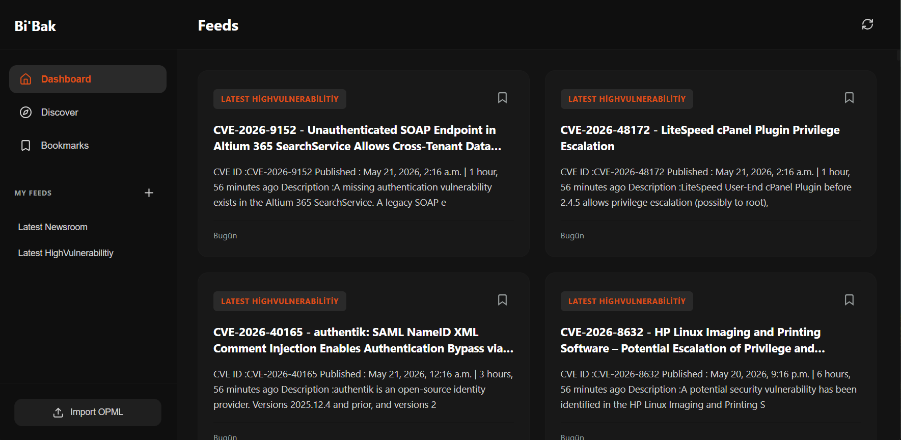

# Bibak RSS Reader

A modern, fast, and fully browser-based RSS reader.

You can add your own RSS feeds, import OPML, bookmark posts, and find new feeds in the Discover tab.

---

## Features

- RSS & Atom support
- Local storage with IndexedDB
- Bookmark system
- OPML import/export
- Discover tab
- Feed filtering
- Mobile-friendly design
- Vanilla JavaScript
- Read/unread state

---

## Screenshot



---

## Technologies

- Vanilla JavaScript
-IndexedDB
- Fetch API
- DOM Parser
- Lucid Icons

---

## Installation

```bash
git clone <repo-url>
cd bibak-rss-reader
```
Run local server:

```bash
npx serve .
```

Or use VSCode Live Server.

---

## Usage

### Adding Feeds

1. Click the Add Feed button
2. Enter the RSS URL
3. Save

### OPML Import

1. Click the Upload button
2. Select the `.opml` file
3. Feeds will be added automatically

---

## Contributing

Pull requests and issues are open
